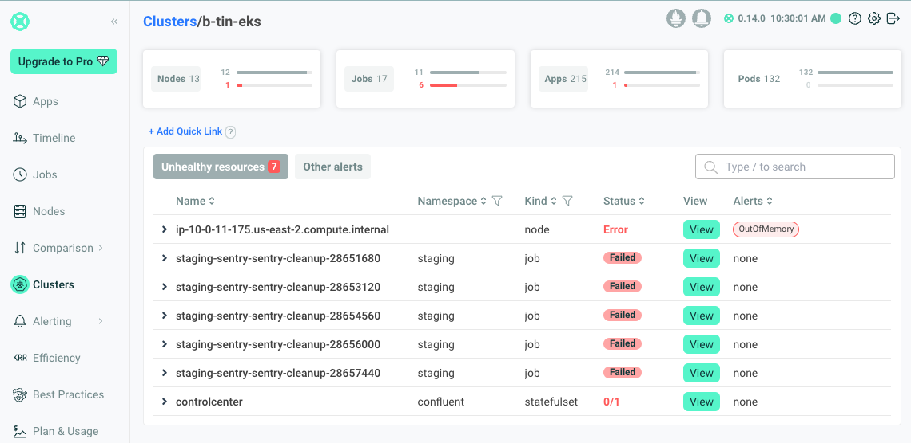
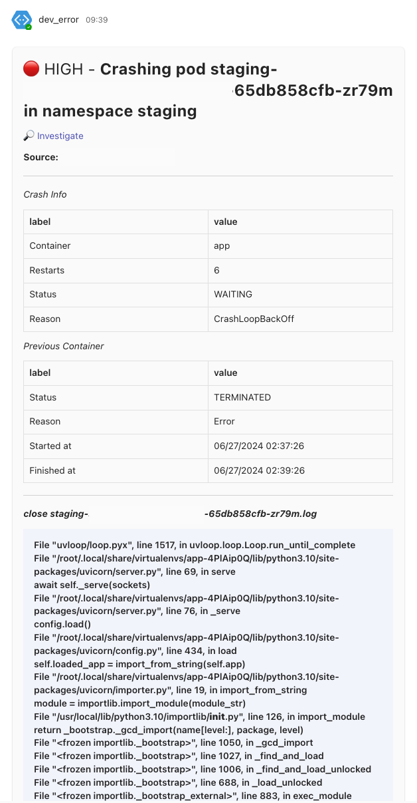

# Kubernetes

## Monitoring

### 1.0. Robusta-Dev

#### Overview

:::note
Robusta is an open-source observability tool for Kubernetes that extends Prometheus. With automation rules, Robusta automatically fetches the data needed to investigate issues and attaches it to your alerts. Learn more at Robusta Documentation https://docs.robusta.dev/.
:::

#### Installation

* _Generate a Config_

  * Robusta requires settings to function, such as a Microsoft Team Token key if you use Microsoft Team. These settings are configured as Helm values.

  * For a quick start, use the Web Installation (recommended). Create the configuration via the free Robusta UI by clicking "Create Config."
  

  * Generate the generated_values.yaml file by registering for a free account at [Robusta](https://platform.robusta.dev/) and connect your existing EKS cluster with your chosen chat notification (Slack, Microsoft Teams, etc.).
  

* _Helm Installation_

  * Add the Robusta Helm repository and update it:
  ```jsx
  helm repo add robusta https://robusta-charts.storage.googleapis.com && helm repo update
  helm search repo robusta/robusta
  helm pull robusta/robusta --version 0.14.0
  ```

  * Install Robusta with the generated values file and verify the connection:
  ```jsx
  helm upgrade \
    --install \
    --create-namespace \
    --namespace monitoring \
    --timeout 30m monitoring-robusta robusta/robusta \
    //highlight-start
    --file ./generated_values.yaml \
    //highlight-end
    --set clusterName=b-tin-eks
  ```
  


#### Integration With Existing Prometheus

* Install Robusta alongside an existing Prometheus. Learn more at [Extend Prometheus Installation.](https://docs.robusta.dev/update-installation-docs/setup-robusta/installation/extend-prometheus-installation.html)

* Modify the generated_values.yaml file and reinstall Robusta with Helm

  ```yaml
  globalConfig:
    signing_key:
    account_id:
    // highlight-start
    alertmanager_url: "http://monitoring-alert-manager.monitoring:9093"
    prometheus_url: "http://monitoring-prometheus-server.monitoring"
    // highlight-end
  sinksConfig:
    - robusta_sink:
        name: robusta_ui_sink
        token:
    - ms_teams_sink:
        name: main_msteams_sink
        webhook_url:
  enablePrometheusStack: false
  enablePlatformPlaybooks: true
  // highlight-start
  enabledManagedConfiguration: true
  // highlight-end
  runner:
    sendAdditionalTelemetry: true
    additional_env_vars: []
  ```

* Update your existing alertmanager configuration

  ```yaml
  apiVersion: v1
  data:
    alertmanager.yml: |
      global: {}
      receivers:
      - name: default-receiver
        webhook_configs:
        - send_resolved: true
          url: http://monitoring-prom2teams.monitoring:8089
      // highlight-start
      - name: 'robusta'
        webhook_configs:
          - url: 'http://monitoring-robusta-runner.monitoring/api/alerts'
            send_resolved: true
      // highlight-end
      route:
        group_interval: 5m
        group_wait: 10s
        receiver: default-receiver
        repeat_interval: 24h
        routes:
        // highlight-start
        - receiver: 'robusta'
          group_by: [ '...' ]
          group_wait: 1s
          group_interval: 1s
          matchers:
            - severity =~ ".*"
          repeat_interval: 4h
          continue: true
        // highlight-end
        - group_by:
          - alertname
          - priority
          matchers:
          - severity="High"
          receiver: default-receiver
          repeat_interval: 1h
        - matchers:
          - severity="Warning"
          receiver: default-receiver
          repeat_interval: 6h
    allow-snippet-annotations: "false"
  ```
  

#### Alert Example

* Alerts from Robusta are sent to your configured chat notifications (e.g., Slack, Microsoft Teams) along with error logs. No need to access the ELK stack or Grafana Loki to check the error.



#### Reference

* [Integrating AlertManager with the UI](https://docs.robusta.dev/master/configuration/alertmanager-integration/troubleshooting-alertmanager.html)
* [In-cluster Prometheus](https://docs.robusta.dev/master/configuration/alertmanager-integration/alert-manager.html)

