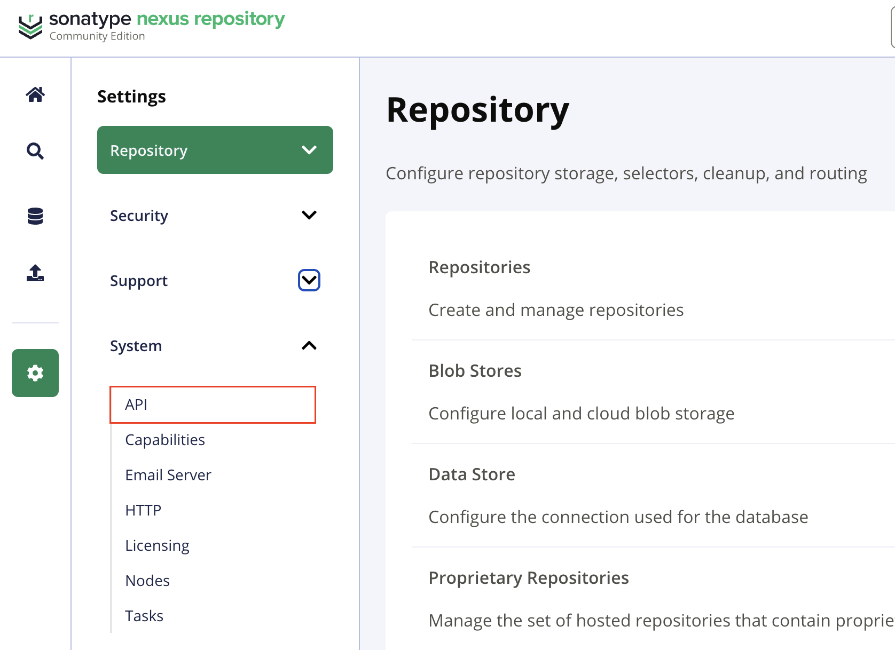
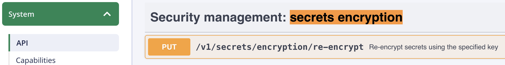
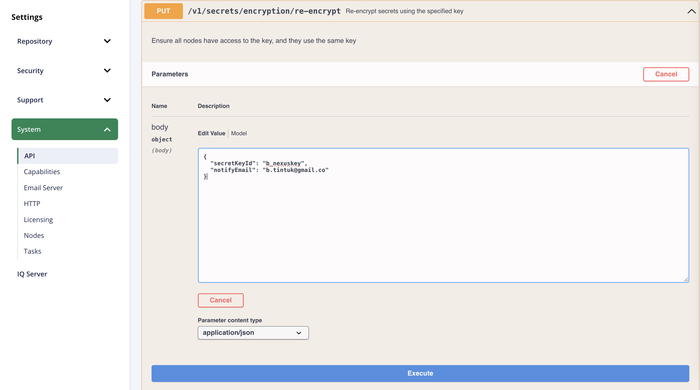
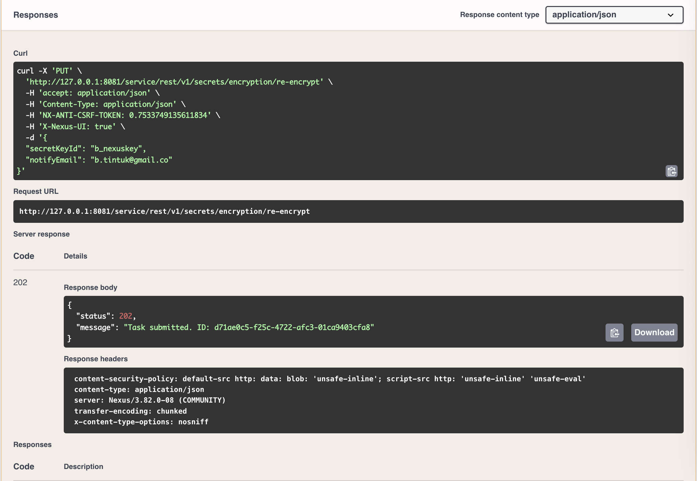

### Install Nexus Repository with a PostgreSQL Database

Nexus Repository™ defaults to an embedded H2 database, which is not recommended for production. This guide shows you how to configure Nexus with an external PostgreSQL database for better reliability and scalability.

➡️ [System Requirements for PostgreSQL](https://help.sonatype.com/en/sonatype-nexus-repository-system-requirements.html)


These instructions are to start Nexus Repository using an external PostgreSQL database.
Download and configure Nexus Repository but do not start the instance.

* See Install Nexus Repository
* Create a PostgreSQL database.
* Set the database configuration.
* Start the Nexus Repository instance.

#### Create a PostgreSQL Database

Following are basic steps for setting up a PostgreSQL Database.

See the PostgreSQL documentation https://www.postgresql.org/docs/current/multibyte.html#id-1.6.11.5.6

* Connect to your PostgreSQL server as a superuser. This is typically 'postgres':
```shell
psql -U postgres
```

Create a new database for Nexus Repository:
```sql
CREATE DATABASE nexus ENCODING 'UTF8' LC_COLLATE = 'en_US.UTF-8' LC_CTYPE = 'en_US.UTF-8' TEMPLATE template0;
```

Connect to the newly created database:
```sql
\c nexus;
```

Create a schema (optional, but recommended):
```sql
CREATE SCHEMA nexus;
```

Create a user for Nexus Repository:
```sql
CREATE USER nexus WITH PASSWORD 'somepassword';
```

Grant necessary privileges to the user:
```sql
GRANT ALL PRIVILEGES ON DATABASE nexus TO nexus;
GRANT ALL PRIVILEGES ON SCHEMA nexus TO nexus;
```

Install the required trigram module. Note that this example command assumes you have created a schema named nexus. If you have not, you can use public:
```sql
CREATE EXTENSION pg_trgm SCHEMA nexus;
```

#### Database Configuration

Nexus Repository supports 3 methods for providing the database configuration settings. When Nexus Repository initially starts, the first connection method encountered is used while the other methods are ignored. Mixing methods are not supported.

The settings are checked in the following order:

* (1) Environment Variables
* (2) JVM Arguments
* (3) the Properties File

In this example, we will use the Environment Variables File method.

_Environment Variables_

Pass the connectivity details as environment variables:

```shell
NEXUS_DATASTORE_NEXUS_JDBCURL
NEXUS_DATASTORE_NEXUS_USERNAME
NEXUS_DATASTORE_NEXUS_PASSWORD
```

Default Nexus login credentials are:
```jsx
Username: admin
Password: admin123
```

### Known Issues

#### Default Admin Credentials


#### Default Secret Encryption Key

_Generate key and json file_

* Generate the key using the following command:
  ```shell
  openssl rand -base64 32
  ```

* Use the following template to create the nexus.secrets.json file. Replace `new-key-generated-from-openssl-command` with the key generated above and set a name for active and id:

  * Filename: `nexus.secrets.json`
  ```jsx
  {
    "active": "b_nexuskey", // Set a name for the active key, any name can be used
    "keys": [
      {
        "id": "b_nexuskey",
        "key": "new-key-generated-from-openssl-command"
      }
    ]
  }
  ```

* Update `docker-compose.yml`

  * Add the JSON file to the volumes section of `docker-compose.yml` file and configure the environment variable for its file path:
    ```jsx
    services:
      postgres:
        image: postgres:11.19-bullseye
        container_name: nexus-postgres
        environment:
          POSTGRES_DB: nexus
          POSTGRES_USER: b_nexususername
          POSTGRES_PASSWORD: b_nexuspassword
        command: postgres -c max_connections=200
        volumes:
          - postgres_data:/var/lib/postgresql/data
        ports:
          - "5432:5432"
        restart: unless-stopped

      nexus:
        image: sonatype/nexus3:3.82.0
        container_name: nexus
        depends_on:
          - postgres
        ports:
          - "8081:8081"
        volumes:
          - nexus_data:/nexus-data
          // highlight-start
          - "./nexus.secrets.json:/opt/sonatype/nexus/etc/nexus.secrets.json"
          // highlight-end
        environment:
          - NEXUS_SECURITY_RANDOMPASSWORD=false
          - INSTALL4J_ADD_VM_PARAMS=-Xms2g -Xmx2g -XX:MaxDirectMemorySize=3g
          - NEXUS_DATASTORE_NEXUS_JDBCURL=jdbc:postgresql://postgres:5432/nexus
          - NEXUS_DATASTORE_NEXUS_USERNAME=b_nexususername
          - NEXUS_DATASTORE_NEXUS_PASSWORD=b_nexuspassword
          - NEXUS_SECRETS_KEY_FILE=/opt/sonatype/nexus/etc/nexus.secrets.json
        restart: unless-stopped

    volumes:
      postgres_data:
      nexus_data:
    ```

* Re-encrypt via the API
  * Open the Nexus website, navigate to `Admin` > `System` > `API`.
  

  * Search for the API endpoint `Security Management: Secrets Encryption`.
  

  * Click and expand `Put /v1/secrets/encryption/re-encrypt` and click `try out` and replace the secretKeyId string with the id of the new key you added in the previous step (e.g., `b_nexuskey` and add a notification email
  
  


### reference

https://anegio.com/posts/2024/nexus-encryption-key/
