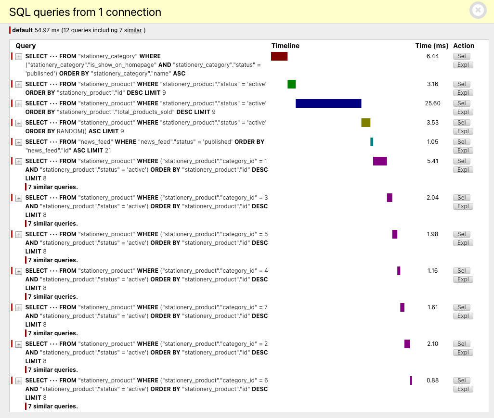
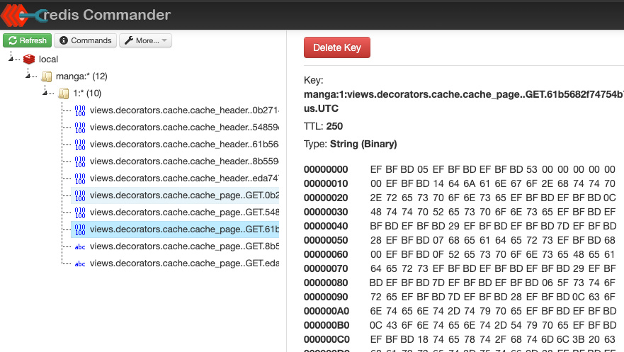

# Python

## Installation

### 1.1 Package `mysqlclient` Installation Issue on Mac M2

#### Problem

:::note
When trying to install the `mysqlclient` package on a Mac M2, you might run into some errors. This issue often pops up due to compatibility problems with certain Python versions.
:::

#### Solution

Here's a quick fix to help you install `mysqlclient` successfully:

**1. Install MySQL Client**: First, let's install an older version of MySQL client that's known to work well:

```shell
// highlight-start
brew install mysql-client@5.7
// highlight-end

# If you need to have mysql-client@5.7 first in your PATH, run:
#   echo 'export PATH="/opt/homebrew/opt/mysql-client@5.7/bin:$PATH"' >> ~/.zshrc#

# For compilers to find mysql-client@5.7 you may need to set:
#   export LDFLAGS="-L/opt/homebrew/opt/mysql-client@5.7/lib"
#   export CPPFLAGS="-I/opt/homebrew/opt/mysql-client@5.7/include"#

# For pkg-config to find mysql-client@5.7 you may need to set:
#   export PKG_CONFIG_PATH="/opt/homebrew/opt/mysql-client@5.7/lib/pkgconfig"

// highlight-start
pip3 install mysqlclient==2.2.4
// highlight-end
```

**2. Update Your PATH:**

To make sure your system recognizes the newly installed MySQL client first, update your PATH by adding the following line to your ~/.zshrc file:

```shell
echo 'export PATH="/opt/homebrew/opt/mysql-client@5.7/bin:$PATH"' >> ~/.zshrc
```

**3. Set Compiler Flags:**

Help your compilers find the MySQL client:

```shell
export LDFLAGS="-L/opt/homebrew/opt/mysql-client@5.7/lib"
export CPPFLAGS="-I/opt/homebrew/opt/mysql-client@5.7/include"
```

#### Reference

For more detailed information and community discussions, check out the Homebrew GitHub discussion on this topic https://github.com/orgs/Homebrew/discussions/569.


## Django

### 2.1 `Django` migrates database from `MySQL` to `PostgreSQL`

#### Overview

:::note
In this tutorial, we will migrate our database from `MySQL` version `5.7` to `PostgreSQL` version `15.7` while using `Django` version `5.0.6`. Although this guide is tailored for `Django` `5.0.6`, some of the steps may vary slightly with different versions of `Django`.
:::

#### Preparation

1. Configure the New Database

First, let's set up our new `PostgreSQL` database in `Django`'s settings. Update your `settings.py` to include both databases until the migration is complete:

```jsx title='/projects/manga/manga/settings.py'
DATABASES = {
	'default': {
		"ENGINE": os.environ['DB_ENGINE'],
		"NAME": os.environ['DB_NAME'],
		"USER": os.environ['DB_USER'],
		"PASSWORD": os.environ['DB_PASSWORD'],
		"HOST": os.environ['DB_HOST'],
		"PORT": os.environ['DB_PORT'],
	},
  // highlight-start
	'postgresql': {
		"ENGINE": "django.db.backends.postgresql_psycopg2",
		"NAME": os.environ['DB_NAME'],
		"USER": os.environ['DB_USER'],
		"PASSWORD": os.environ['DB_PASSWORD'],
		"HOST": os.environ['DB_HOST'],
		"PORT": os.environ['DB_PORT'],
	}
  // highlight-end
}
```

2. Migrate the Database Schema

Apply the existing migrations to your new `PostgreSQL` database with the following command:

```shell
python3 manage.py migrate --database=postgresql
```

Note: The `syncdb` command is deprecated in newer versions of `Django`, and the `--no-initial-data` flag has also been removed.

3. Clean Up the New Database

Before transferring the data, ensure the new database is clean. This step involves removing any initial data that might conflict with your existing data:

```shell
python3 manage.py sqlflush --database=postgresql
```

4. Transfer Data

To move your data, use Django's dumpdata and loaddata commands. Make sure to use the --natural-foreign option to handle foreign keys correctly:

```shell
# Dump all data from the old database
python3 manage.py dumpdata --all --natural-foreign > /tmp/dump_YYYYMMDD.json

# Load the data into the new PostgreSQL database
python3 manage.py loaddata /tmp/dump_YYYYMMDD.json --database=postgresql
```

5. Update Configuration

After transferring all data, configure `PostgreSQL` as the `default` database in your `settings.py`:

```jsx title='/projects/manga/manga/settings.py'
DATABASES = {
  // highlight-start
	'mysql': {
  // highlight-end
		"ENGINE": os.environ['DB_ENGINE'],
		"NAME": os.environ['DB_NAME'],
		"USER": os.environ['DB_USER'],
		"PASSWORD": os.environ['DB_PASSWORD'],
		"HOST": os.environ['DB_HOST'],
		"PORT": os.environ['DB_PORT'],
	},
  // highlight-start
	'default': {
  // highlight-end
		"ENGINE": "django.db.backends.postgresql_psycopg2",
		"NAME": os.environ['DB_NAME'],
		"USER": os.environ['DB_USER'],
		"PASSWORD": os.environ['DB_PASSWORD'],
		"HOST": os.environ['DB_HOST'],
		"PORT": os.environ['DB_PORT'],
	}
}
```

Once you've completed the above steps, test your application thoroughly to ensure everything works as expected with the new `PostgreSQL` database. Adjust your configurations or troubleshoot any issues that arise during testing.

#### Reference
For additional details and tips on migrating from `MySQL` to `PostgreSQL` using `Django`, visit this comprehensive guide https://blog.libove.org/posts/django-migrate-mysql-to-postgres/

With this guide, migrating your `Django` application from `MySQL` to `PostgreSQL` should be smooth and efficient. Happy coding!


### 2.2 `Django` with `Redis` caching

#### Overview

:::note
Caching is like having a speedy storage spot for data that's frequently used or costly to fetch. In `Django`, integrating `Redis` as a caching solution speeds up data retrieval, making your applications snappier and more efficient. Let's dive into how to set this up!
:::

#### Installation

**1. Install Necessary Packages**

Install the following packages by adding them to your project dependencies:

```
redis[hiredis]==5.0.7
django-debug-toolbar==4.4.6
```


**2. Update Your Settings**

In your `settings.py`, make the following changes:

* Debug Toolbar: Useful for monitoring cache performance among other things, ensure it's enabled only in debug mode for security.

```python
if DEBUG:
  INTERNAL_IPS = ["127.0.0.1"]

INSTALLED_APPS = [
  ...  # Other apps
  "debug_toolbar",
]

MIDDLEWARE = [
  ...  # Other middleware
  "debug_toolbar.middleware.DebugToolbarMiddleware",
]

CACHES = {
  "default": {
    "BACKEND": "django.core.cache.backends.redis.RedisCache",
    "LOCATION": "redis://localhost:6378/",
    "KEY_PREFIX": "manga",
    "TIMEOUT": 60 * 1,  # 1 minute
  }
}

CACHE_TTL = 60 * 5  # Cache time to live is 5 minutes.
```

**3. Configure URLs**

Make sure the **Debug Toolbar** is accessible by configuring your `urls.py` accordingly:

```python
urlpatterns = [
  path("admin/", admin.site.urls),
  path("", include("news.urls")),
  path("shop/", include("stationery.urls")),
  path("__debug__/", include("debug_toolbar.urls")),
]
```

**4. Enable Caching in Views**

Leverage `Django`'s caching capabilities in your views to minimize database hits:

```python
from django.shortcuts import render
from django.views.decorators.cache import cache_page
from .models import Category
from .helper import chunk_array

CACHE_TTL = getattr(settings, 'CACHE_TTL', DEFAULT_TIMEOUT)

@cache_page(CACHE_TTL)
def index(request):
  items_category = cache.get('cache_items_category')
  if not items_category:
    items_category = Category.objects.filter(
      is_show_on_homepage=True,
      status=APP_VALUE_CATEGORY_CHOICE_STATUS_DEFAULT
    ).order_by('name')
    cache.set('cache_items_category', items_category, 20)  # 20 seconds expire
```

By decorating your view functions with `@cache_page`, you define how long each page should be stored in the cache, drastically reducing load times and improving user experience.





#### Reference

Check out these additional resources to further enhance your understanding of caching in `Django` with `Redis`:

* https://aisaastemplate.com/blog/django-caching-guide/
* https://fly.io/django-beats/caching-in-django-with-redis/
* https://dev.to/emmakodes_/how-to-use-redis-to-cache-data-for-your-django-project-dl5