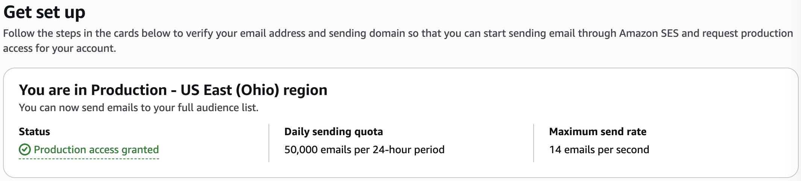
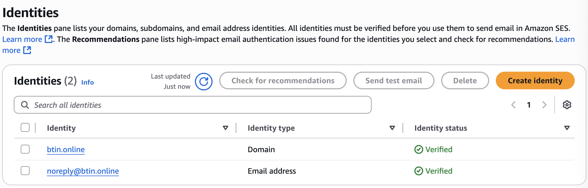
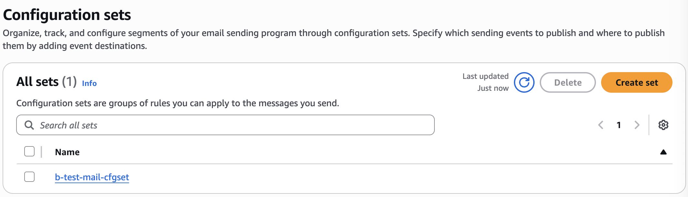
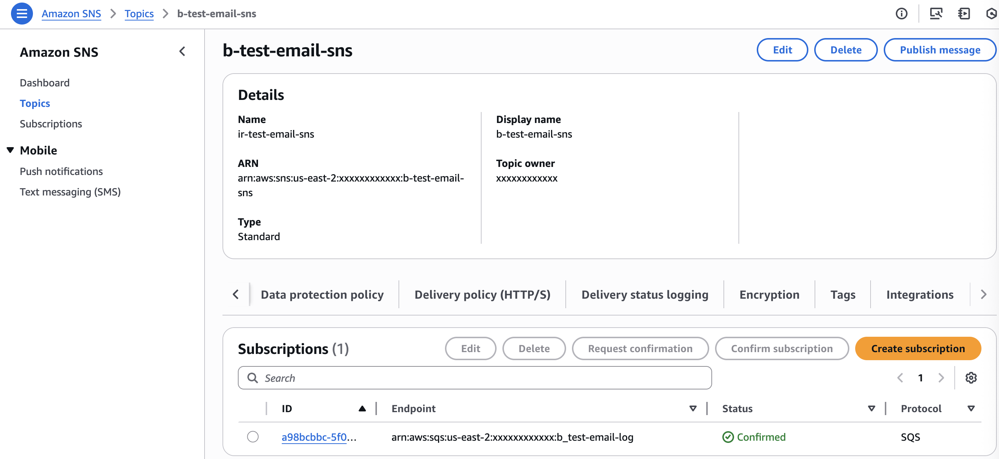
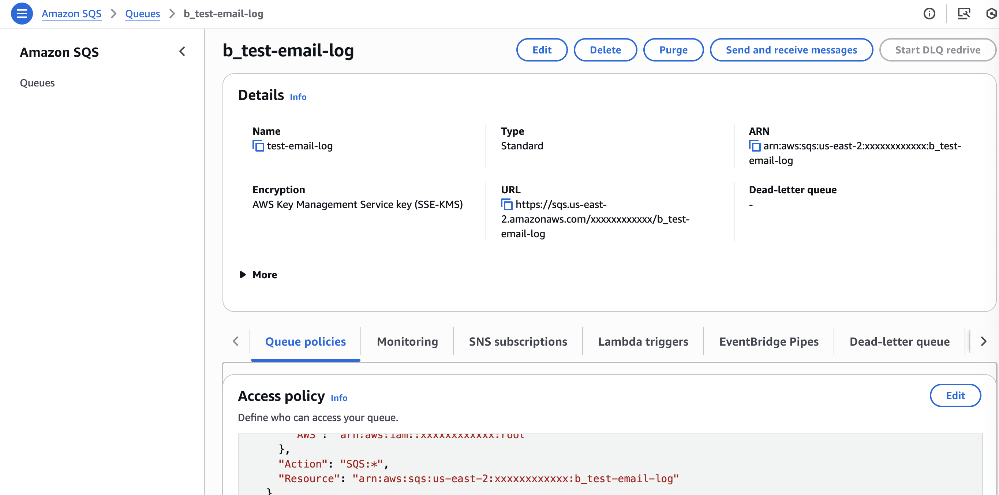
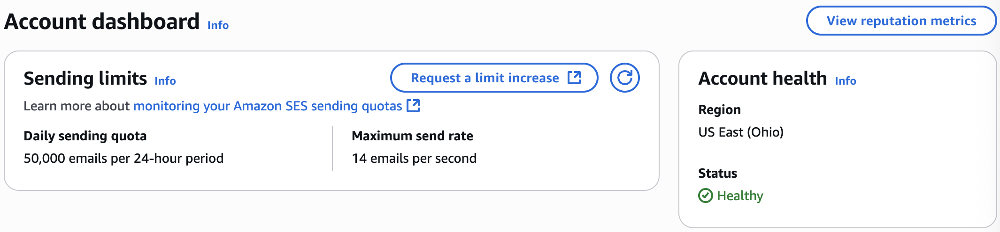
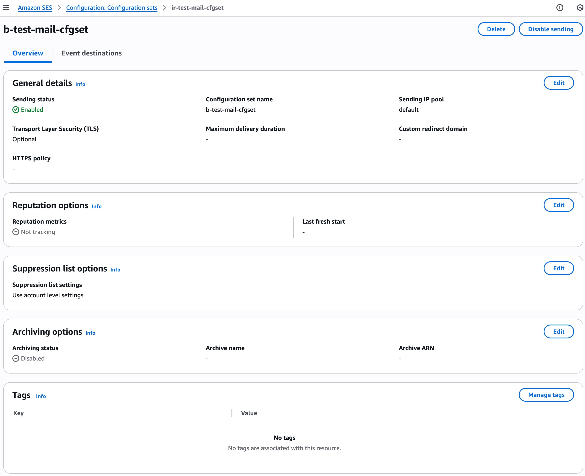
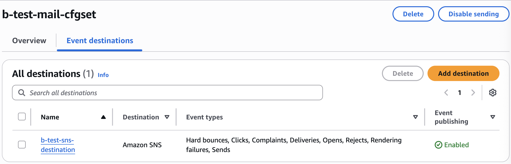
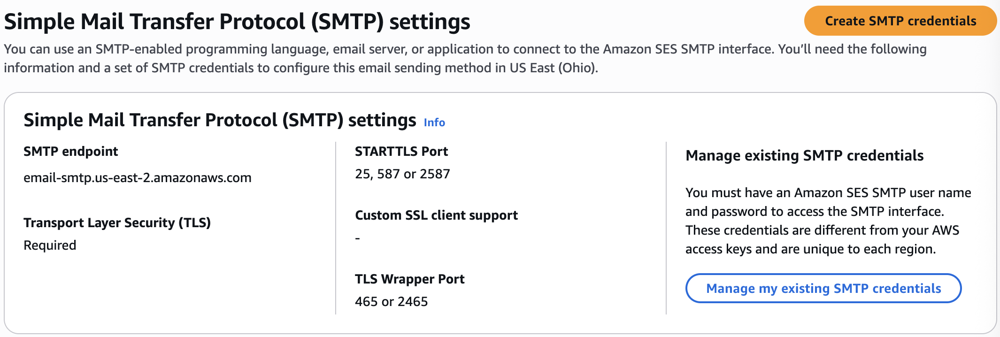
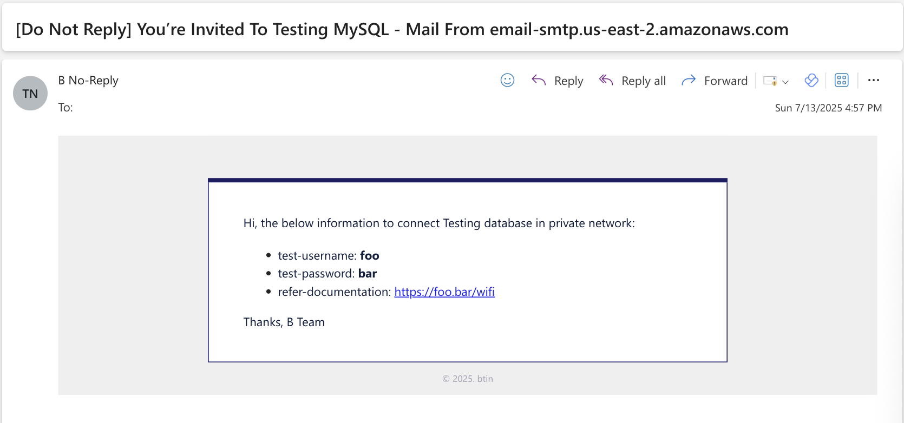

### 1.1 Send Email with Amazon SES

:::info
This comprehensive guide walks you through setting up Amazon Simple Email Service (SES) in the US East (Ohio) region with email tracking capabilities using configuration sets, SNS topics, and SQS queues.
:::

#### Overview

Amazon SES is a cloud-based email sending service that helps you send marketing, notification, and transactional emails. This setup includes:

* SES Production Access: Ability to send emails to any recipient
  
* Domain and Email Verification: Verified identities for sending emails
  
* Configuration Sets: Track and manage email sending events
  
* SNS Integration: Real-time notifications for email events
  
* SQS Subscriptions: Queue-based tracking for email status updates
  

<ins>_Prerequisites_</ins>
* AWS Account with appropriate permissions
* A verified domain (for production use)
* Basic understanding of AWS services (SES, SNS, SQS)

#### Request SES Production Access

By default, AWS SES starts in Sandbox mode, which restricts email sending to verified addresses only. To send emails to any recipient, you need production access.

<ins>_Request Production Access_</ins>
* Navigate to the SES Console in US East (Ohio) region
* Go to Account Dashboard
* Click "Request a limit increase"
* Fill out the production access request form with:
  * Use case description: Explain your email sending purpose
  * Expected sending volume: Estimated daily/monthly email volume
  * Bounce and complaint handling: Describe your processes
  * Compliance measures: How you ensure CAN-SPAM compliance

<ins>_Production Access Benefits_</ins>

* Daily sending quota: 50,000 emails per 24-hour period (default)
* Maximum send rate: 14 emails per second (default)
* Full audience access: Send to any valid email address
:::note
Note: Production access approval typically takes 24-48 hours. You can request limit increases as your needs grow.
:::

#### Verify Identity (Domain and Email)

Before sending emails, you must verify your sending identities. AWS SES supports both domain and email address verification.

<ins>_Verify Domain Identity_</ins>
* Go to SES Console → Identities
* Click "Create identity"
* Select "Domain"
* Enter your domain (e.g., `btin.online`)
* Choose verification method:
  * DNS records (recommended)
  * Email verification

<ins>_DNS Verification Process_</ins>
* AWS provides DNS records to add to your domain
* Add the following records to your DNS provider:
  * TXT record: For domain ownership verification
  * CNAME records: For DKIM authentication
  * MX record: If using SES for receiving emails

<ins>_Verify Email Address_</ins>
* In Identities, click "Create identity"
* Select "Email address"
* Enter email address (e.g., `noreply@btin.online`)
* Check your email for verification link
* Click the verification link

#### Setup SES Configuration Set

Configuration sets help you track email sending events and apply consistent settings across email campaigns.


<ins>_Create Configuration Set_</ins>
* Navigate to SES Console → Configuration sets
* Click "Create set"
* Enter configuration set name (e.g., `b-test-mail-cfgset`)
* Configure the following options:
  * General Details
  * Reputation Options
  * Suppression List Options
  * Archiving Options

<ins>_Configuration Set Benefits_</ins>
* Event tracking: Monitor bounces, complaints, deliveries, opens, clicks
* Reputation management: Track sending reputation metrics
* Sending policies: Apply consistent rules across campaigns
& Event destinations: Route events to SNS, CloudWatch, or other services (in this example, SNS)

#### Add SNS Destination to SES Configuration Set

SNS (Simple Notification Service) enables real-time notifications for email events from your configuration set.

<ins>_Create Event Destination_</ins>
* Go to your configuration set (e.g., `b-test-mail-cfgset`)
* Click "Event destinations" tab
* Click "Add destination"
* Configure the destination:
  
  * Destination Settings
    * Name: `b-test-sns-destination`
    * Destination: Amazon SNS
    * Event types: Select events to track:
      * ✅ Hard bounces: Permanent delivery failures
      * ✅ Clicks: Link clicks in emails
      * ✅ Complaints: Spam complaints
      * ✅ Deliveries: Successful deliveries
      * ✅ Opens: Email open events
      * ✅ Rejects: SES rejected emails
      * ✅ Rendering failures: Template rendering errors
      * ✅ Sends: Email send events
  * Event Publishing
    * Event publishing: Enabled
    * SNS topic: Select your SNS topic (e.g., `b-test-email-sns`)

<ins>_SNS Topic Configuration_</ins>
* Ensure your SNS topic is properly configured:
  * Topic name: `b-test-email-sns`
  * Display name: Human-readable name
  * Type: Standard (not FIFO for this use case)

#### SNS Add SQS Subscription to Track Email Status

SQS (Simple Queue Service) provides a reliable queue for processing email event notifications from SNS.

<ins>_Create SQS Queue_</ins>
* Navigate to SQS Console
* Click "Create queue"
* Configure queue settings:
  * Queue Configuration
    * Name: `b_test-email-log`
    * Type: Standard
    * Encryption: AWS Key Management Service (SSE-KMS) or Customer-Managed Key
    * URL: https://sqs.us-east-2.amazonaws.com/xxxxxxxxxxxx/b_test-email-log
  * Queue Policies
    * Allow SNS to publish messages to this queue
    * Add the following policy to allow SNS to send messages:
      ```json
      {
        "Version": "2012-10-17",
        "Id": "__default_policy_ID",
        "Statement": [
          {
            "Sid": "__owner_statement",
            "Effect": "Allow",
            "Principal": {
              "AWS": "arn:aws:iam::xxxxxxxxxxxx:root"
            },
            "Action": "SQS:*",
            "Resource": "arn:aws:sqs:us-east-2:xxxxxxxxxxxx:b_test-email-log"
          },
          {
            "Sid": "topic-subscription-arn:aws:sns:us-east-2:xxxxxxxxxxxx:b-test-email-sns",
            "Effect": "Allow",
            "Principal": {
              "Service": "sns.amazonaws.com"
            },
            "Action": "SQS:SendMessage",
            "Resource": "arn:aws:sqs:us-east-2:xxxxxxxxxxxx:b_test-email-log",
            "Condition": {
              "ArnLike": {
                "aws:SourceArn": "arn:aws:sns:us-east-2:xxxxxxxxxxxx:b-test-email-sns"
              }
            }
          },
          {
            "Sid": "topic-subscription-arn:aws:sns:us-east-2:xxxxxxxxxxxx:b_test_email_event",
            "Effect": "Allow",
            "Principal": {
              "Service": "sns.amazonaws.com"
            },
            "Action": "SQS:SendMessage",
            "Resource": "arn:aws:sqs:us-east-2:xxxxxxxxxxxx:b_test-email-log",
            "Condition": {
              "ArnLike": {
                "aws:SourceArn": "arn:aws:sns:us-east-2:xxxxxxxxxxxx:b_test_email_event"
              }
            }
          }
        ]
      }
      ```

<ins>_Create SNS Subscription_</ins>
* Go to SNS Console → Topics
* Select your topic (e.g., `b-test-email-sns`)
* Click "Create subscription"

#### Email Event Processing Flow

:::info
SES Email Event → Configuration Set → SNS Topic → SQS Queue → Application
:::

#### Send Test Email



Here's a Python script to send emails programmatically using AWS SES with your configuration set:

<details>
  <summary>Folder Structure</summary>
  ```
  ├── send_test_email.py
  ├── read_sqs.py
  └── templates
  └── testing_email.html
  ```
</details>

<details>
  <summary>File send_test_email.py</summary>
  ```python title="send_test_email.py"
  import os
  import smtplib
  import logging
  import email.utils
  from email.mime.multipart import MIMEMultipart
  from email.mime.text import MIMEText
  from dataclasses import dataclass
  from typing import Optional

  # Setup logging
  logging.basicConfig(level=logging.INFO)
  logger = logging.getLogger(__name__)


  @dataclass
  class TestUser:
      username: str
      password: str
      wiki: str
      email: str

      @property
      def subject(self) -> str:
          ses_host = os.environ.get("SES_HOST")
          return f"[Do Not Reply] You’re Invited To Testing MySQL - Mail From {ses_host}"


  def load_template(template_path: str) -> Optional[str]:
      try:
          with open(template_path, "r") as f:
              return f.read().strip()
      except Exception as e:
          logger.error(f"Failed to load template: {template_path} - {e}")
          return None


  def render_template(template: str, replacements: list[tuple[str, str]]) -> str:
      for placeholder, value in replacements:
          template = template.replace(placeholder, value)
      return template


  def build_email_content(user: TestUser) -> Optional[str]:
      template = load_template("./templates/testing_email.html")
      if not template:
          return None
      return render_template(template, [
          ("REPLACE_USERNAME", user.username),
          ("REPLACE_PASSWORD", user.password),
          ("REPLACE_WIKI", user.wiki)
      ])


  def send_email(user: TestUser):
      content = build_email_content(user)
      if not content:
          logger.error("No email content to send.")
          return

      msg = MIMEMultipart('alternative')
      msg['Subject'] = user.subject
      msg['From'] = email.utils.formataddr(
          (os.environ['SENDER_NAME'], os.environ['SENDER_EMAIL']))
      msg['To'] = user.email
      msg.add_header('X-SES-CONFIGURATION-SET',
                     os.environ.get('SES_CONFIGURATION_SET', ''))
      msg.attach(MIMEText(content, 'html'))

      try:
          with smtplib.SMTP(os.environ['SES_HOST'], int(os.environ['SES_PORT'])) as smtp:
              smtp.ehlo()
              smtp.starttls()
              smtp.ehlo()
              smtp.login(os.environ['SES_USERNAME'], os.environ['SES_PASSWORD'])
              smtp.sendmail(os.environ['SENDER_EMAIL'],
                            user.email, msg.as_string())
          logger.info(f"Email sent to {user.email}")
      except Exception as e:
          logger.error(f"Failed to send email to {user.email}: {e}")


  if __name__ == "__main__":
      mysql_wiki = 'https://foo.bar/wifi'

      users = [
          TestUser(
              username='foo',
              password='bar',
              wiki=mysql_wiki,
              email='b.tintuk@gmail.com'
          ),
      ]

      for user in users:
          send_email(user)
  ```
</details>

<details>
  <summary>File template HTML</summary>
  ```html title="templates/testing_email.html"
  <style type="text/css">
      .alert {
          padding: 15px;
          background-color: #201C4E;
          color: white;
      }
  </style>
  <table bgcolor="#F1F1F1" border="0" cellpadding="0" cellspacing="0" style="background:#F1F1F1;width: 100%; height: 100%; font-size: 14px;line-height: 1.5;border-collapse: collapse;">
      <tbody>
          <tr>
              <td>
              <table align="center" bgcolor="#FFFFFF" border="0" cellpadding="0" cellspacing="0" style="background: #FFFFFF; width:100%;max-width:600px;">
                  <tbody>
                      <tr>
                          <td bgcolor="#F1F1F1" style="height: 33px; padding: 8px 20px; vertical-align: bottom; width: 580px; background: #F1F1F1;">&nbsp;</td>
                      </tr>
                      <tr>
                          <td style="font-size: 0px; padding: 0px 0px; color: #FFFFFF; border-bottom: 5px solid #1e1c6e;">&nbsp;</td>
                      </tr>
                      <tr>
                          <td style="padding: 22px 40px; border: 1px solid #1e1c6e; border-top: none;">
                          <p><span style="color: #0a1f44;"><span style="font-family:courier new,courier,monospace;">​​</span><span style="caret-color: #0a1f44; color: #0a1f44;">Hi, the below information to connect Testing database in private network: </span></span></p>
                          <ul>
                              <li><span style="color: #0a1f44;">test-username: <strong>REPLACE_USERNAME</strong></span></li>
                              <li><span style="color: #0a1f44;">test-password: <strong>REPLACE_PASSWORD</strong></span></li>
                              <li><span style="color: #0a1f44;">refer-documentation: <a href="REPLACE_WIKI">REPLACE_WIKI</a></span></li>

                          </ul>
                          <p><span style="color:#0a1f44;">Thanks, B Team</span></p>
                          </td>
                      </tr>
                  </tbody>
              </table>

              <p style="text-align:center;color:#aaabbb;font-size:8pt">&copy; 2025. btin</p>
              </td>
          </tr>
      </tbody>
  </table>
  ```
</details>


<details>
  <summary>File read_sqs.py</summary>
  ```python title="read_sqs.py"
  import json
  import boto3

  # Configure this with your actual queue URL
  SQS_QUEUE_URL = 'https://sqs.us-east-2.amazonaws.com/xxxxxxxxxxxx/b_test-email-log'


  def process_ses_notification(message_body):
      try:
          notification = json.loads(message_body)  # SES directly, no SNS wrapper
          event_type = notification.get('eventType')

          mail = notification.get('mail', {})
          destination = mail.get('destination', [])
          message_id = mail.get('messageId')

          print(f"[{event_type}] Message ID: {message_id}")
          print(f"Recipients: {', '.join(destination)}")

          if event_type == 'Delivery':
              delivery = notification.get('delivery', {})
              print(f"Delivered at: {delivery.get('timestamp')}")
              print(f"SMTP Response: {delivery.get('smtpResponse')}")
          elif event_type == 'Bounce':
              bounce = notification.get('bounce', {})
              print(f"Bounce Type: {bounce.get('bounceType')}")
              print(f"Bounce Subtype: {bounce.get('bounceSubType')}")
          elif event_type == 'Complaint':
              complaint = notification.get('complaint', {})
              print(f"Complaint Type: {complaint.get('complaintFeedbackType')}")
          elif event_type == 'Send':
              print("Send event (queued for delivery).")
          elif event_type == 'Open':
              open_event = notification.get('open', {})
              print(f"Opened at: {open_event.get('timestamp')}")
              print(f"User Agent: {open_event.get('userAgent')}")
          else:
              print(f"[Info] Unhandled event type: {event_type}")

          print("-" * 60)

      except Exception as e:
          print(f"Error processing message: {e}")


  def poll_sqs_messages():
      sqs = boto3.client('sqs')
      while True:
          response = sqs.receive_message(
              QueueUrl=SQS_QUEUE_URL,
              MaxNumberOfMessages=5,
              WaitTimeSeconds=10  # long polling
          )

          messages = response.get('Messages', [])

          # print(f"Messages: {messages}")

          if not messages:
              print("No new messages.")
              break  # remove this if you want to loop forever

          for message in messages:
              print(f"Processing Message ID: {message['MessageId']}")
              process_ses_notification(message['Body'])

              # Delete the message after processing
              sqs.delete_message(
                  QueueUrl=SQS_QUEUE_URL,
                  ReceiptHandle=message['ReceiptHandle']
              )


  if __name__ == "__main__":
      poll_sqs_messages()
  ```
</details>

<ins>_Example Output_</ins>

```shell
❯ {
  export SES_CONFIGURATION_SET=b-test-mail-cfgset
  export SENDER_NAME='B No-Reply'
  export SES_HOST=email-smtp.us-east-2.amazonaws.com
  export SES_PORT=587
  export SENDER_EMAIL=noreply@btin.online
  export SES_USERNAME=xxxxxxxxxxxxxx # Your SMTP username
  export SES_PASSWORD=xxxxxxxxxxxxxx # Your SMTP password
}

❯ python3 read_sqs.py
Processing Message ID: 11680a7d-bca0-431e-a667-d989c96bfca2
[None] Message ID: 010f01980337faf8-xxxxxxxx-xxxx-xxxx-xxxx-xxxxxxxxxxxx-000000
Recipients: user@example.com
[Info] Unhandled event type: None
------------------------------------------------------------
Processing Message ID: 51354fe3-07d7-4c7c-9e84-7cffa9b2c8cc
[Send] Message ID: 010f01980337faf8-xxxxxxxx-xxxx-xxxx-xxxx-xxxxxxxxxxxx-000000
Recipients: user@example.com
Send event (queued for delivery).
------------------------------------------------------------
Processing Message ID: be4a8d46-ffad-4835-bdea-9ef42c9b82a3
[Open] Message ID: 010f01980327e1ca-xxxxxxxx-xxxx-xxxx-xxxx-xxxxxxxxxxxx-000000
Recipients: user@example.com
Opened at: 2025-07-13T09:40:14.095Z
User Agent: Mozilla/5.0 (Macintosh; Intel Mac OS X 10_15_7) AppleWebKit/537.36 (KHTML, like Gecko) Chrome/138.0.0.0 Safari/537.36
------------------------------------------------------------
Processing Message ID: e8a6e049-065e-439a-99ce-8be41fe22b54
[Open] Message ID: 010f01980337faf8-xxxxxxxx-xxxx-xxxx-xxxx-xxxxxxxxxxxx-000000
Recipients: user@example.com
Opened at: 2025-07-13T09:57:44.606Z
User Agent: Mozilla/5.0 (Macintosh; Intel Mac OS X 10_15_7) AppleWebKit/537.36 (KHTML, like Gecko) Chrome/138.0.0.0 Safari/537.36
------------------------------------------------------------
Processing Message ID: d9274b1d-6149-4421-81ce-7186419c1546
[Delivery] Message ID: 010f01980327e1ca-xxxxxxxx-xxxx-xxxx-xxxx-xxxxxxxxxxxx-000000
Recipients: user@example.com
Delivered at: 2025-07-13T09:40:03.924Z
SMTP Response: 250 2.6.0 <010f01980327e1ca-xxxxxxxx-xxxx-xxxx-xxxx-xxxxxxxxxxxx-000000@us-east-2.amazonses.com> [InternalId=2705829408361, Hostname=EXAMPLE.domain.com] 17867 bytes in 0.143, 122.007 KB/sec Queued mail for delivery
```

