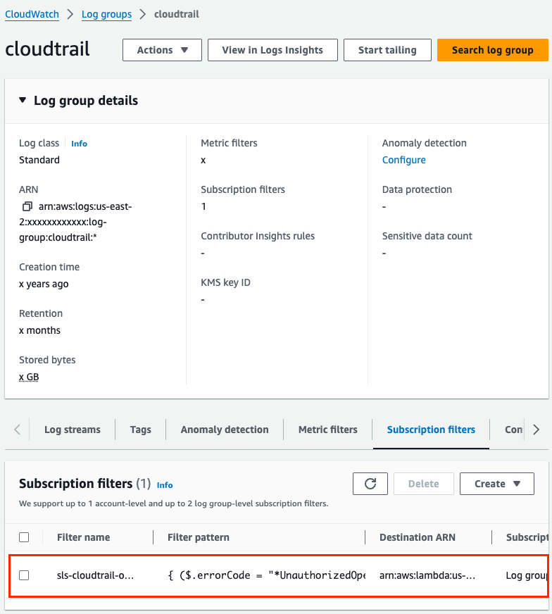

# Serverless Framework

## Plugins

### 1.1 Plugin To Register AWS CloudWatchLogs Subscription Filter

##### Info

:::note
Serverless plugin to register AWS CloudWatchLogs subscription filter.
`serverless-plugin-subscription-filter`
:::

##### Installation

To install the plugin, run the following command:

```shell
npm install --save-dev serverless-plugin-subscription-filter
```

Next, add the plugin to your serverless.yml:

```jsx
plugins:
  // highlight-start
  - serverless-plugin-subscription-filter
  // highlight-end
```

##### Usage

Here’s an example of how to use the plugin in your serverless.yml file:

```jsx
functions:
  monitoring:
    handler: handler.ops_1308
    layers:
      - "${cf:create-lambda-layers-ops.BtinDashpython311DashrequestsLambdaLayerQualifiedArn}"
      - "${cf:create-lambda-layers-ops.BtinDashpython311DashmarshmallowLambdaLayerQualifiedArn}"
    timeout: 60
    description: OPS-1308
    tags:
      monitoring: 'true'
    // highlight-start
    events:
      - subscriptionFilter:
          stage: ops
          logGroupName: cloudtrail
          filterPattern: '{ ($.errorCode = "*UnauthorizedOperation") || ($.errorCode = "AccessDenied*") }'
    // highlight-end
```



##### Update Plugin

:::warning
A new update increases the filter subscription support with a new limit. For more information, check out this pull request https://github.com/tsub/serverless-plugin-subscription-filter/pull/31.
:::

##### Reference

For more details, visit the [Serverless Plugin](https://www.serverless.com/plugins/serverless-plugin-subscription-filter)  Documentation.
