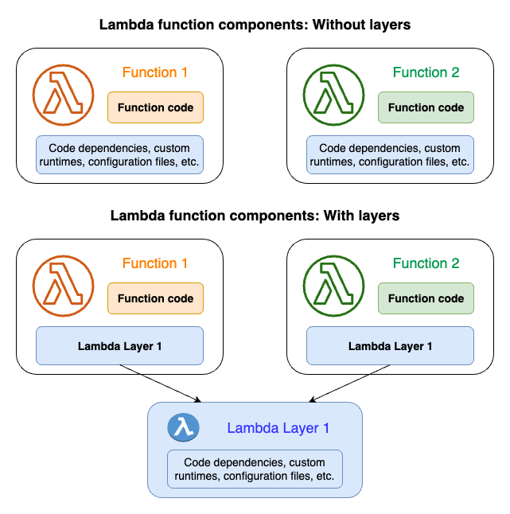
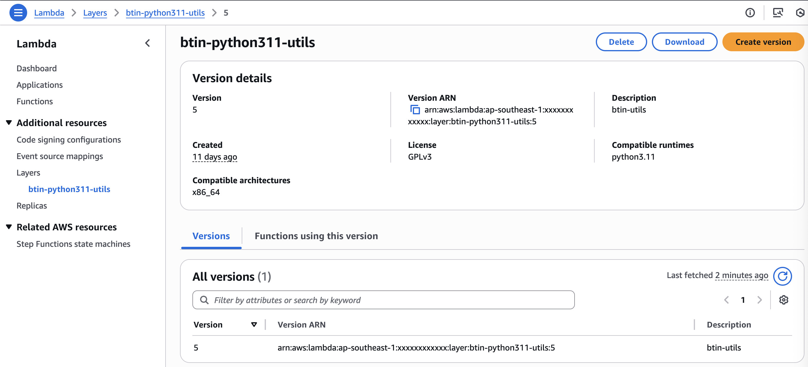
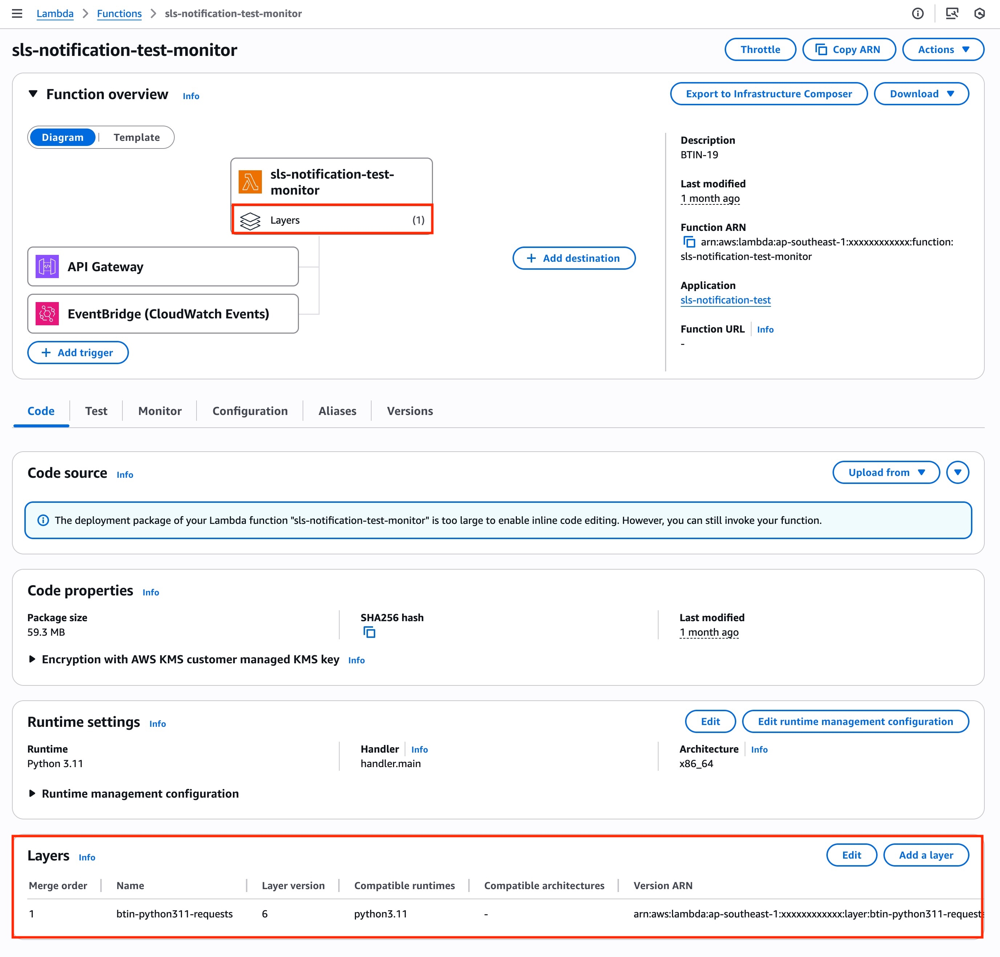

### Introduction to AWS Lambda Layers

##### Info

:::note
AWS Lambda layers provide a convenient way to package libraries, custom runtimes, or other function dependencies separately from your function code. Layers promote code sharing and separation of concerns so that you can iterate on your function code more quickly.
:::


Ref: [AWS Lambda Layers](https://docs.aws.amazon.com/lambda/latest/dg/configuration-layers.html)

##### Benefits

- **Code Reusability**: Share common dependencies across multiple Lambda functions
- **Smaller Deployment Packages**: Function code packages are smaller without bundled dependencies
- **Faster Deployments**: Only update layers when dependencies change
- **Version Management**: Layer versions are immutable and can be referenced by multiple functions

### Creating Lambda Layers with Serverless Framework

##### Manual Package Creation

To create a Lambda layer manually, follow these steps:

```shell
# Set environment variables
export PYTHON_VERSION=3.11
export PYTHON_PACKAGE='pandas'

# Create layer structure
mkdir -p "layer/python/lib/python${PYTHON_VERSION}/site-packages"
pip3 install $PYTHON_PACKAGE -t "layer/python/lib/python${PYTHON_VERSION}/site-packages/"

# Package layer
cd layer/
zip -r ${PYTHON_PACKAGE}.zip *
```

##### Automated Package Generation

Use the provided script to generate multiple package layers:

<details>
  <summary>File generate-packages.sh</summary>
  ```bash title="./scripts/generate-packages.sh"
  #!/bin/bash

  set -e

  main() {
    arr_packages=( "mysql-connector-python" "numpy" "pandas" "PyMySQL" "requests" "SQLAlchemy" "marshmallow" "pytz")
    arr_python_versions=( "3.11" )

    # prepare-directory-for-storing-layer-zip-file
    mkdir -p layers

    for version in "${arr_python_versions[@]}"; do
        layer_path="python/lib/python${version}/site-packages"

        for package in "${arr_packages[@]}"; do
            # cleanup-for-fetch-installation
            rm -rf ./python && mkdir -p $layer_path

            pip3 install $package -t $layer_path
            python3 -c "import shutil;shutil.make_archive('${version}-${package}','zip',root_dir='.', base_dir='python')"

            # copy-layer-zip-file-layer-folder
            mv ${version}-${package}.zip layers/
        done # # end-for-arr_packages
    done # end-for-arr_python_versions
  }

  main "$@"
  ```
</details>

This script creates layers for the following Python packages (or any packages you specify):
- mysql-connector-python
- numpy
- pandas
- PyMySQL
- requests
- SQLAlchemy
- marshmallow
- pytz

### Serverless Configuration

##### Layer Definition

Here's how to define Lambda layers in your `serverless.yml`:

```jsx
service: create-lambda-layers

provider:
  name: aws
  region: ap-southeast-1
  deploymentBucket:
    name: btin-serverless-aps1-share-bucket
    serverSideEncryption: AES256

package:
  individually: true

layers:
  btin-python311-utils:
    path: layers/utils
    package:
      artifact: layers/utils/utils.zip
    compatibleRuntimes:
      - python3.11
    compatibleArchitectures:
      - x86_64
    licenseInfo: GPLv3
    description: "btin-utils"

  btin-python311-mysql-connector-python:
    package:
      artifact: 3.11-mysql-connector-python.zip
    compatibleRuntimes:
      - python3.11
    description: "btin-mysql-connector-python"

  btin-python311-requests:
    package:
      artifact: 3.11-requests.zip
    compatibleRuntimes:
      - python3.11
    description: "btin-requests"

  btin-python311-PyMySQL:
    package:
      artifact: 3.11-PyMySQL.zip
    compatibleRuntimes:
      - python3.11
    description: "btin-pymysql"

  btin-python311-SQLAlchemy:
    package:
      artifact: 3.11-SQLAlchemy.zip
    compatibleRuntimes:
      - python3.11
    description: "btin-sqlalchemy"

  btin-python311-numpy:
    package:
      artifact: 3.11-numpy.zip
    compatibleRuntimes:
      - python3.11
    description: "btin-numpy"

  btin-python311-pandas:
    package:
      artifact: 3.11-pandas.zip
    compatibleRuntimes:
      - python3.11
    description: "btin-pandas"

  btin-python311-marshmallow:
    package:
      artifact: 3.11-marshmallow.zip
    compatibleRuntimes:
      - python3.11
    description: "btin-marshmallow"

  btin-python311-pytz:
    package:
      artifact: 3.11-pytz.zip
    compatibleRuntimes:
      - python3.11
    description: "btin-pytz"

plugins:
  - serverless-deployment-bucket
  - serverless-prune-plugin

custom:
  prune:
    automatic: true
    number: 3
  deploymentBucket:
    versioning: false
    accelerate: true
    blockPublicAccess: true
```

##### Using Layers in Functions

Reference layers in your Lambda functions:

```jsx
functions:
  monitoring:
    handler: handler.monitoring_handler
    // highlight-start
    layers:
      - "${cf:create-lambda-layers-ops.BtinDashpython311DashutilsLambdaLayerQualifiedArn}"
      - "${cf:create-lambda-layers-ops.BtinDashpython311DashpandasLambdaLayerQualifiedArn}"
    // highlight-end
    timeout: 60
    description: "CloudWatch monitoring function"
    events:
      - sns:
          arn: !Ref CloudWatchAlarmTopic
```

### Layer Naming Convention

##### Standard Format

Our Lambda layers follow this naming convention:



```
btin-python311-<package-name>
```

Examples:
- `btin-python311-pandas`
- `btin-python311-requests`
- `btin-python311-utils`

##### Package Files

ZIP files are named using:

```
<python-version>-<package-name>.zip
```

Examples:
- `3.11-pandas.zip`
- `3.11-requests.zip`
- `utils.zip`

### Utility Layer Components

##### CloudWatch Alerting Functions

The utility layer includes functions for CloudWatch alarm processing:

```python
# Parse SNS messages from CloudWatch alarms
def parse_sns_message(event):
    sns_message = json.loads(event['Records'][0]['Sns']['Message'])
    # Process alarm data...

# Send alerts to Microsoft Teams
def alert_chat(message):
    # Send webhook notification...

# Send email alerts via AWS SES
def alert_email(content_html, message, type):
    # Send email notification...
```

##### Usage in Lambda Functions



```jsx
import json
// highlight-start
import requests
from utils import parse_sns_message, alert_chat, alert_email
// highlight-end

def lambda_handler(event, context):
    # Parse CloudWatch alarm from SNS
    message = parse_sns_message(event)

    if message:
        # Send chat notification
        alert_chat(message)

        # Send email alert
        content_html = generate_email_html(message, 'cloudwatch')
        alert_email(content_html, message, 'cloudwatch')

    return {'statusCode': 200}
```

### Deployment and Management

##### Deploy Layers

Deploy all layers to AWS:

```shell
serverless deploy --stage <your-stage>
```

##### AWS Configuration

- **Region**: ap-southeast-1
- **Deployment Bucket**: btin-serverless-aps1-share-bucket
- **Runtime**: Python 3.11
- **Architecture**: x86_64
- **License**: GPLv3

##### Layer Versioning

:::warning
Layer versions are immutable. When you update a layer, AWS creates a new version. Update your function configurations to reference the new layer version.
:::

### Best Practices

##### Layer Organization

- Keep layers focused on specific functionality
- Separate third-party packages from custom utilities
- Use consistent naming conventions
- Document layer contents and versions

##### Performance Considerations

- Lambda cold starts increase with layer size
- Optimize layer contents to include only necessary files
- Consider layer loading order for dependencies

##### Reference

For more details, visit the [AWS Lambda Layers](https://docs.aws.amazon.com/lambda/latest/dg/configuration-layers.html) Documentation.